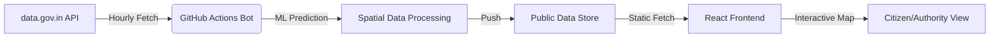

# 🌍 Delhi Ward-Wise AQI Intelligence Platform
> **Empowering Delhi with Hyper-Local, AI-Driven Air Quality Insights**

[](https://vikash23mar05.github.io/Hack4Delhi/)
[](https://github.com/vikash23mar05/Hack4Delhi/actions)
[](https://github.com/vikash23mar05/Hack4Delhi/actions)

---

## 🏛️ The Challenge: The Granularity Gap
Delhi's 250+ wards currently rely on city-wide AQI averages. However, pollution in **Okhla** is vastly different from **Civil Lines**. Existing monitoring stations are sparse, leaving 80% of wards with "estimated" or no data.

## 🧠 Our Solution: Autonomous Intelligence
We have built a **self-sustaining AI ecosystem** that bridges this gap using real-time government data and spatial machine learning.

### 1. 🤖 The "Ward-Wise" AI Bot
Our backend doesn't run on a server—it runs on **GitHub Actions**. Every 60 minutes, an autonomous Python worker:
- **Fetches**: Real-time sensor data from the official `data.gov.in` API.
- **Predicts**: Calculates AQI for every single ward in Delhi using **Inverse Distance Weighting (IDW)** spatial interpolation.
- **Self-Updates**: Pushes fresh predictions back to the repository, keeping the dashboard alive 24/7 without human intervention.

### 2. 🗺️ Hyper-Local Visualizations
- Interactive heatmap of all 250+ wards.
- Click-to-Explore: Individual ward fingerprints, health advisories, and source attribution.
- Comparison Mode: See how your ward compares to the city average in real-time.

---

## 🛠️ Technical Infrastructure

| Layer | Technology | Role |
| :--- | :--- | :--- |
| **Frontend** | React + Vite + TS | High-performance, responsive ward-wise mapping. |
| **Automation** | GitHub Actions | Periodic data ingestion and ML model execution. |
| **Data Engine** | Python (Pandas/Requests) | Spatial interpolation and AQI prediction. |
| **API** | `data.gov.in` | Official real-time station-level telemetry. |
| **Styling** | Vanilla CSS + HSL | Premium, glassmorphic design system. |

---

## 🚀 How It Works (The Pipeline)


## 📈 Key Features for Authorities
- **Priority Queue**: Automatically ranks wards by pollution severity for immediate intervention.
- **Source Attribution**: AI-driven analysis of whether pollution is Vehicular, Industrial, or Biomass-based.
- **SLA Tracking**: Monitors response times for pollution-related complaints submitted by citizens.

---

## 🛠️ Setting Up Local Development

```bash
# 1. Clone the repo
git clone https://github.com/vikash23mar05/Hack4Delhi.git

# 2. Install dependencies
npm install

# 3. Add your .env secrets (Optional)
# DATA_GOV_KEY=your_key_here

# 4. Run the dashboard
npm run dev
```

## 🏗️ Future Roadmap
- [ ] **Sentinel-5P Integration**: Incorporating Satellite Aerosol Optical Depth (AOD) for higher precision.
- [ ] **Predictive Forecasting**: 24-hour AQI forecasting using LSTM neural networks.
- [ ] **Mobile App**: Cross-platform notifications for ward-level health alerts.

---
**Created for Hack4Delhi 2026**  
*"A Delhi where every ward breathes clean air, and every policy is powered by data."*
ward-wise-intelligence
npm install

# Run development server
npm run dev
